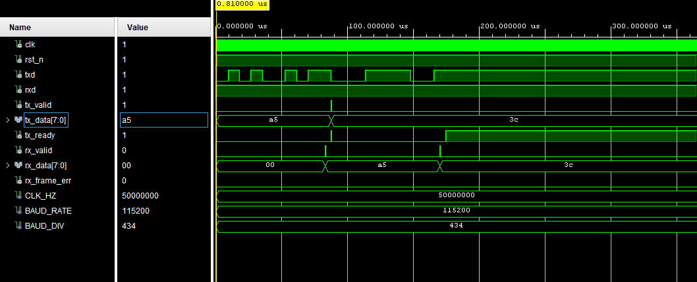

# FPGA-Based UART Design (VHDL)

This repository presents a fully synthesizable, FSM-based UART (Universal Asynchronous Receiver/Transmitter) core implemented in VHDL.  
The design includes independent TX and RX modules, robust RX input synchronization, and a top-level integration supporting internal loopback.  

The project is verified at RTL level using self-checking testbenches and simulation waveform analysis.

## UART Loopback Waveform

This waveform demonstrates successful internal TX → RX loopback verification at RTL level.

- TX start bit, data bits (LSB first), and stop bit are correctly generated
- RX performs mid-bit sampling after proper start-bit detection
- rx_valid is asserted for one clock cycle upon successful frame reception
  


## Project Structure
```
FPGA-Based-UART-Design/
├── rtl/
│ ├── uart_tx.vhd -- UART transmitter (FSM-based)
│ ├── uart_rx.vhd -- UART receiver with input synchronization
│ └── uart_top.vhd -- Top-level integration with optional loopback
│
├── tb/
│ ├── tb_uart_tx.vhd -- Self-checking TX testbench
│ ├── tb_uart_rx.vhd -- RX testbench (good frame & frame error cases)
│ └── tb_uart_top.vhd -- End-to-end loopback verification
│
├── docs/
│ └── *.png -- Simulation waveform screenshots
│
├── README.md
└── .gitignore
```
## Design Overview

- Standard UART frame format: 1 start bit, 8 data bits, no parity, 1 stop bit
- Configurable baud rate via VHDL generics
- FSM-based architectures for both TX and RX modules
- RX input synchronized using a double flip-flop technique
- Active-low synchronous reset

## UART Transmitter (uart_tx)

- Accepts data using a one-clock-cycle `tx_valid` handshake
- Indicates availability through `tx_ready`
- Generates start bit, data bits (LSB first), and stop bit
- Baud-rate timing derived from system clock using a counter

## UART Receiver (uart_rx)

- Asynchronous RX input synchronized using a 2-FF synchronizer
- Start bit detection with half-bit confirmation
- Mid-bit sampling for data bits
- Stop bit validation with frame error detection
- Outputs received byte with a one-clock-cycle `rx_valid` pulse

## Top-Level Integration (uart_top)

- Integrates TX and RX modules
- Optional internal loopback (TXD → RXD) enabled via generic
- Suitable for both standalone simulation and FPGA integration

## Verification Strategy

All modules are verified using self-checking testbenches:

- TX testbench verifies bit timing, start/stop bits, and data integrity
- RX testbench verifies correct reception and frame error detection
- Top-level testbench verifies end-to-end UART communication using internal loopback

Simulation waveforms are provided in the `docs/` directory.

## Tools

- Language: VHDL
- Simulator: Vivado Simulator (or any compatible VHDL simulator)

## Usage

1. Clone the repository
2. Run the desired testbench under the `tb/` directory
3. Observe assertions and waveform outputs for verification

----------------------------------------------------------------------------------------------
## UART Protocol Overview

----------------------------------------------------------------------------------------------

 # FPGA Tabanlı UART Tasarımı (VHDL)

Bu repo, VHDL ile geliştirilmiş, tam sentezlenebilir ve FSM tabanlı bir UART (Universal Asynchronous Receiver/Transmitter) çekirdeğini sunmaktadır.
Tasarım; bağımsız TX ve RX modüllerini, sağlam RX giriş senkronizasyonunu ve dahili loopback destekli üst seviye entegrasyonu içermektedir.

Proje, RTL seviyesinde self-checking testbench’ler ve simülasyon dalga formu analizleri kullanılarak doğrulanmıştır.

## Proje Yapısı
```
FPGA-Based-UART-Design/
├── rtl/
│ ├── uart_tx.vhd -- UART transmitter (FSM-based)
│ ├── uart_rx.vhd -- UART receiver with input synchronization
│ └── uart_top.vhd -- Top-level integration with optional loopback
│
├── tb/
│ ├── tb_uart_tx.vhd -- Self-checking TX testbench
│ ├── tb_uart_rx.vhd -- RX testbench (good frame & frame error cases)
│ └── tb_uart_top.vhd -- End-to-end loopback verification
│
├── docs/
│ └── *.png -- Simulation waveform screenshots
│
├── README.md
└── .gitignore
```
## Tasarım Özeti

- Standart UART çerçevesi: 1 başlangıç biti, 8 veri biti, parity yok, 1 stop biti
- Generic parametreler ile ayarlanabilir baud hızı
- TX ve RX için FSM tabanlı mimari
- RX hattı için çift flip-flop senkronizasyonu
- Aktif düşük senkron reset yapısı

## UART Verici (uart_tx)

- `tx_valid` sinyali ile 1 clock genişliğinde veri kabulü
- `tx_ready` ile vericinin hazır durumu
- Start biti, veri bitleri (LSB first) ve stop biti üretimi
- Sistem saatinden türetilmiş baud zamanlaması

## UART Alıcı (uart_rx)

- Asenkron RX girişinin 2FF ile senkronizasyonu
- Start bit için yarım-bit doğrulaması
- Veri bitleri için orta-bit örnekleme
- Stop bit kontrolü ve frame error tespiti
- Alınan byte için 1 clock’luk `rx_valid` darbesi

## Üst Seviye Entegrasyon (uart_top)

- TX ve RX modüllerinin entegrasyonu
- Generic ile kontrol edilen dahili loopback (TXD → RXD)
- Hem simülasyon hem FPGA entegrasyonu için uygun yapı

## Doğrulama Yaklaşımı

Tüm modüller self-checking testbench’ler ile test edilmiştir:

- TX testbench: bit zamanlaması ve veri bütünlüğü
- RX testbench: doğru çerçeve ve stop bit hatası senaryoları
- Top-level testbench: uçtan uca UART loopback doğrulaması

Simülasyon dalga formları `docs/` klasöründe yer almaktadır.

## Kullanılan Araçlar

- Dil: VHDL
- Simülatör: Vivado Simulator veya uyumlu VHDL simülatörleri

## Kullanım

1. Repoyu klonlayın
2. `tb/` altındaki testbench’lerden birini çalıştırın
3. Assertion mesajları ve dalga formlarını inceleyin

## Author
Hasan Burak Çiftçi  
Electrical & Electronics Engineer 
